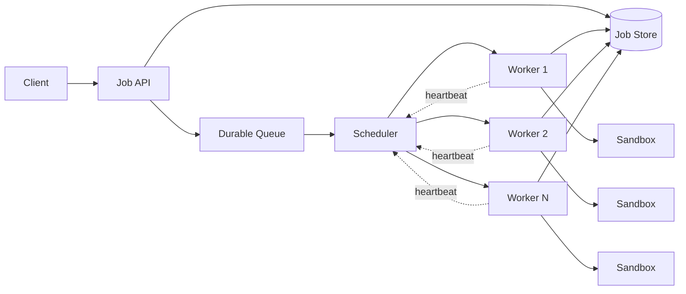

# Deep dive — Scheduler, Lease, and Failure Recovery

> Belongs to [System Design #1](../designs/agent-execution-platform.md), §8 §9 §18.

The interviewer points at the Scheduler box and asks *why*, *what if it fails*,
and *what happens at 100×*.

**What is being tested.** Not whether you know the word "lease". Whether you can
derive it — because the derivation is what you have to reproduce at a whiteboard,
and a memorised conclusion collapses on the second follow-up.

So this document is built as the derivation: the naive design, what breaks, the
fix, what breaks next.

---

## 1. Why a scheduler at all

The user submits:

```text
Run this coding agent on repo X
```

The naive implementation looks sufficient:

```text
API  →  pick a worker  →  start container  →  run agent
```

At 10K concurrent agents it is not, and the questions it cannot answer are the
specification:

```text
which worker has capacity?
how much CPU/RAM does this job need?
who goes first?
can one tenant take every worker?
what if a worker dies?
what if the machine disappears two hours into a job?
what if 50K jobs arrive at once?
```

So the scheduler's job is not *starting containers*. It is:

> **continuously, safely and fairly mapping pending work onto finite execution
> capacity.**

Starting the container is the easy part and the wrong thing to describe.

---

## 2. Three things that must not be conflated



| | is | holds |
|---|---|---|
| **Job Store** | source of truth | `job_id, status, attempt, assigned_worker, checkpoint, resource_request` |
| **Queue** | what is waiting | ordering and readiness, nothing authoritative |
| **Scheduler** | the decision | which job goes to which worker, and when to take it back |

Conflating them is the most common structural mistake in this answer. In
practice the queue is often a view over the store (§6), but the *roles* stay
distinct: one is truth, one is order, one is policy.

---

## 3. What breaks: assignment is not ownership

Suppose the scheduler hands out the job and considers itself done.

```text
12:00:00   scheduler → worker-17: run job-123
12:00:01   worker-17 starts
12:35:00   worker-17's machine dies
```

The job was going to run for two hours. **How does the scheduler find out?**

Not from the worker. A crashed process cannot say

```text
"I'm dead."
```

Any design that requires the failed party to participate in its own funeral does
not work. Detection has to be something the scheduler can conclude **alone**.

---

## 4. The fix: lease

The scheduler does not say *job-123 belongs to worker-17*. It says:

> **worker-17 holds the right to execute job-123 until time T.**

```text
job_id       123
worker       worker-17
lease_until  12:00:30
```

The worker renews every 10 s:

```text
12:00:10  →  lease until 12:00:40
12:00:20  →  lease until 12:00:50
12:00:30  →  lease until 12:01:00
```

While the worker is healthy the lease walks forward. When it stops, the lease
expires on its own — **no cooperation from the failed worker is required**,
which is precisely the property §3 showed was missing.

### Recovery, concretely

```text
12:34:40   last renewal, lease_until = 12:35:10
12:34:45   worker dies
12:35:10   lease expires

           RUNNING
              ↓      reaper sees status=RUNNING with an expired lease
           RECOVERING
              ↓      load latest checkpoint
           QUEUED
              ↓      scheduler assigns worker-42
           RUNNING
```

### Choosing the numbers

| | short lease (10 s) | long lease (5 min) |
|---|---|---|
| detection | fast | job idle for minutes |
| false expiry | frequent under GC pause or a network blip | rare |
| renewal load | high | low |

**Detection time is bounded below by how long a healthy worker can be silent.**
A stop-the-world pause or a CPU-throttled container can stall a process for
seconds; a lease shorter than the worst tolerable stall converts stalls into
evictions, and evicting a two-hour job costs far more than a minute of delayed
detection.

Reasonable: **lease 30 s, renew every 10 s**, so two consecutive renewals can be
lost before expiry. End-to-end recovery is `lease + schedule + sandbox start`
≈ 30 + 1 + 2 = **~33 s**, plus whatever work happened since the last checkpoint.

---

## 5. "Why not just use heartbeats?"

This follow-up comes almost every time, and the answer is a distinction rather
than a mechanism:

```text
heartbeat  =  evidence of liveness
lease      =  time-bounded authority
```

A heartbeat is a **signal**: it tells you something was alive at some past
instant. It does not tell you when you are *permitted* to act on its absence.
Two observers can disagree about whether a heartbeat was missed, and both can be
right.

A lease defines **when the system is entitled to consider the original owner to
have lost the right to execute**. It is an ownership semantic with an expiry,
not an observation — which is why it can be enforced by a store that never saw
the worker at all (§7).

Heartbeats are how a lease gets renewed. They are not a substitute for one.

---

## 6. What breaks next: the old worker is not dead

The failure is not a crash but a partition:

```text
                   network partition
                          ✕
    worker-17 ────────────✕──────────── scheduler
```

worker-17 is still running the agent. The scheduler simply cannot hear it. The
lease expires, the job is reassigned, and now:

```text
worker-17  →  job 123
worker-42  →  job 123
```

**Two workers executing the same job.** Which is the point to state plainly:

> a lease is not exactly-once execution.

A lease bounds *authority*, not *activity*. It guarantees the scheduler may
safely reassign; it guarantees nothing about what the old holder is still doing.

Making the lease longer does not fix this — it only widens the window in which
the job is stalled while a worker is genuinely dead. The damage has to be made
**impossible**, not unlikely. That is §7 and §8.

---

## 7. Fencing: making the zombie harmless

### Fencing tokens

Every lease carries a **monotonically increasing epoch**. Every write that
matters carries the epoch. Storage rejects writes from a stale one.

```text
worker A   lease epoch 7   ──▶ write checkpoint (epoch 7)   ✓ accepted
           (partitioned; lease expires)
worker B   lease epoch 8   ──▶ write checkpoint (epoch 8)   ✓ accepted
worker A   (still alive)   ──▶ write checkpoint (epoch 7)   ✗ rejected, stale
```

The store does the enforcement, not the worker, because a partitioned worker
cannot be trusted to know it has been fenced. This applies to the checkpoint
store, to the job status transition, and to the event stream — anywhere a zombie
could otherwise corrupt state.

### Self-fencing, and the sandbox

Fencing protects the control plane's state. It does **not** stop a zombie from
burning money: the old sandbox is still running, still calling the model, still
executing tools with real side effects.

Two mechanisms, and you need both:

1. **The worker watches its own lease.** If renewal fails for longer than the
   lease, it kills its sandboxes without waiting to be told. This handles the
   common case, a worker that is healthy but briefly partitioned.
2. **The sandbox has its own TTL, renewed only by its worker.** If the worker
   process itself dies, nothing renews, and the sandbox self-terminates. This
   handles the case the first mechanism cannot: the worker is gone but the host
   and the VM are fine.

Belt and braces is correct here, because the two mechanisms fail in different
ways — the first depends on the worker being alive to act, the second on the
host being alive to enforce.

---

## 8. At-least-once, and what to do about duplicate effects

Given the above, the honest guarantee is **at-least-once**. Say so directly, and
say why you are not attempting exactly-once:

> Exactly-once across a process boundary and a side-effecting sandbox is not
> achievable; what is achievable is at-least-once delivery with idempotent
> effects, and I would rather put the effort into idempotency at the tool
> boundary than into a distributed protocol that still cannot cover a `git push`.

### Classify the effects

| class | example | handling |
|---|---|---|
| pure | read a file, run a test | re-run freely |
| idempotent with a key | write an object, upsert a row | dedup key derived from `(job_id, step, tool_call_id)` |
| genuinely at-most-once | `git push`, send an email, charge a card | write-ahead intent, then a dedup check at the boundary |

Agents make this harder than ordinary batch work. A batch job reads, computes,
writes. An agent may `git push`, open a pull request, send mail, call a payment
API, modify a database, deploy. None of those are safe to simply retry.

So the **tool layer**, not the agent loop, carries the key:

```text
create_pull_request(
    repo = X,
    patch = Y,
    idempotency_key = "job123-step47"
)
```

A second execution calls with the same key and the tool service returns the
first result instead of opening a second PR. The key is derived from position in
the trajectory, never from a hash of the model's output — see below for why that
distinction is not pedantic.

For the third class: record the intent in durable storage **before** performing
the effect, keyed by the deterministic tuple above. On resume, the platform
checks whether that key already completed. This does not make the effect
transactional; it makes a repeat detectable, which is what is actually needed.

### And the part specific to this workload

A **re-run model call is not a repeat — it is a new sample.** Even at
temperature 0 a serving stack does not reproduce itself: repeated identical
requests differ in content, in tool calls, sometimes in how many commands the
agent is handed. So a duplicated execution does not redo the same work slightly
wastefully; it **branches the trajectory**.

Consequences:

- Resume from a checkpoint is a *continuation*, not a replay. Never describe it
  as replay in the interview; it will not survive the follow-up.
- The trajectory must record which steps were retried, or users cannot account
  for their own runs.
- Deduplication keys must be derived from `(job_id, step)` — position in the
  trajectory — and **not** from a hash of the model's output, which is not
  stable across attempts.

---

## 9. Checkpoints: how much work is lost, and how often to pay

Recovery is only cheap if there is something to recover to.

```text
step 0 → ... → step 80 → worker crash
```

With no checkpoint, the replacement worker restarts at step 0 and eighty steps
of tokens and tool time are gone. With a checkpoint every ten steps:

```text
checkpoint @ step 70
crash      @ step 78
new worker → restore step 70 → continue
```

Eight steps lost instead of seventy-eight.

### What has to be in it

The lesson that does not come from a textbook: **restoring the source code is not
restoring the agent.**

```text
AgentCheckpoint
├── message history
├── tracked workspace state
├── untracked / scratch workspace
├── agent runtime metadata
├── tool state
└── step and budget state
```

Drop the scratch files and the resumed agent contradicts itself — it remembers
writing a reproduction script, reads it back, and is told the file does not
exist. What follows is not a resumed job, it is a confused one. (Full treatment
in deep dive #3.)

### How often

There is no single right answer, and saying so with the tradeoff is the answer:

```text
expected loss  ≈  failure rate × work since last checkpoint
checkpoint cost ≈  snapshot size × frequency
```

Checkpoint every step and recovery is nearly free while storage I/O dominates.
Every hundred steps and it is cheap until something crashes.

What works in practice is **periodic plus event-triggered**:

```text
every 10 steps
AND immediately before:
    an external side effect
    a large code modification
    an expensive tool call
    context compaction
```

The event-triggered half is what makes §8 tractable: if a checkpoint always
precedes a side effect, the recovery boundary and the idempotency boundary are
the same boundary.

---

## 10. Placement: which worker, actually

The naive loop:

```text
for each queued job:
    find a worker with enough CPU/RAM
    assign
```

At scale the inputs are more than fit:

```text
resource fit        tenant fairness      priority
data locality       sandbox image locality      expected duration
```

Image locality is the one people miss, and it can dominate. A job needing
2 CPU / 8 GB with image `swebench/astropy`:

| | free capacity | image | verdict |
|---|---|---|---|
| Worker A | 4 CPU, 16 GB | **cached** | wins |
| Worker B | 16 CPU, 64 GB | not cached | loses |

A is the better placement despite having a quarter of the headroom, because
pulling a multi-gigabyte image turns a two-second sandbox start into a
two-minute one — and the startup SLO is p50 under 2 s.

**Expected duration is listed and should be distrusted.** Measured on a single
fixed task, run lengths ranged from three minutes to over six hours. Any packing
decision that leans on a duration estimate will be wrong often enough to matter.

---

## 11. Scheduler durability and leader election

Two questions hide here: *is the scheduler stateful*, and *what happens when it
dies*.

**Make the scheduler stateless over a durable job store.** All authoritative
state — job status, lease holder, lease epoch, expiry — lives in the store. The
scheduler is a loop that reads schedulable jobs and tries to claim them for
workers. If it dies, another instance takes over with no handoff, because there
was no in-memory state worth handing off.

### Do you need leader election?

Only if two scheduler instances can assign the same job. **Use a conditional
write instead:**

```sql
UPDATE jobs
   SET worker_id = :w, lease_epoch = lease_epoch + 1,
       lease_expires_at = now() + interval '30 seconds',
       status = 'running'
 WHERE job_id = :j
   AND (status = 'queued'
        OR (status = 'running' AND lease_expires_at < now()))
```

The row is the lock. Two schedulers race; one update applies, the other affects
zero rows and moves on. **This removes leader election entirely** — worth saying
out loud, because reaching for leader election when a conditional update will do
is a common over-design.

When you *would* want a single leader: global decisions that cannot be made per
row — bin-packing across the whole fleet, or preemption choices that need a
consistent view. Then run one leader for *placement* while keeping claiming
optimistic, so leader failure degrades packing quality rather than stopping the
platform.

### What must be durable

| component | durable? | on crash |
|---|---|---|
| Agent API | no | stateless replicas behind a load balancer |
| Scheduler | no | another instance continues from the store |
| Job store | **yes** | the platform stops; replicate, this is the one |
| Lease / heartbeat store | yes, but cheap | see §12 — different store at scale |
| Checkpoint store | **yes** | jobs cannot resume; running jobs continue, admission pauses |
| Event bus | yes | buffer at the worker, backfill; do not block the agent loop |

The line to hold: **the agent loop must never block on the observability path.**
If the event bus is down, the worker buffers and keeps going. Losing telemetry is
bad; stalling ten thousand jobs because a Kafka broker is unhappy is worse.

---

## 12. Why the job store is the queue

The natural question: *why not Kafka or SQS?*

| | fit | problem |
|---|---|---|
| Kafka | high throughput, ordered | no per-message ack with arbitrary timeout; consumer owns a partition, not a message; rebalancing a 3-hour job is not meaningful |
| SQS | visibility timeout **is** a lease | max 12 h, no priority, no per-tenant fairness, no query "what is this tenant running" |
| Job table with lease columns | queries, fairness, priority, and lease in one place | you write the polling loop; throughput is bounded by the database |

For 10K concurrent jobs the table wins easily, and the reason generalises:
**when the unit of work lives for hours, the queue is a small, slow-changing,
heavily-queried collection — which is a database, not a log.** A log is the right
answer when the unit of work is a message; here it is a machine.

Poll with a bounded, indexed query and jittered intervals so schedulers do not
synchronise:

```sql
SELECT job_id FROM jobs
 WHERE status = 'queued'
    OR (status = 'running' AND lease_expires_at < now())
 ORDER BY priority DESC, submitted_at
 LIMIT 100
```

---

## 13. Admission, fairness, and preemption

### Admission

Little's law gives the shape:

```text
concurrency = arrival rate × duration
100K jobs/day × 0.5 h avg  ≈  2,080 average concurrent
peak design point          =  10,000
```

But **duration cannot be predicted** — measured on one fixed task, runs ranged
from 3 minutes to over 6 hours. So admission cannot reserve by expected duration.
Admit against **currently free capacity** with a headroom reservation, and let
the queue absorb the rest.

### Fairness

Weighted fair queuing over **concurrent slots**, not over submissions. A tenant
that submitted once four hours ago is still consuming; fairness measured on
arrivals would let a tenant with long jobs quietly take the fleet.

```text
enterprise : 500 concurrent slots
free       : 5 concurrent slots
```

Per-tenant caps as well as weights, because weights alone do not bound the
damage when only one tenant is active and then a second arrives.

### Preemption

Only ever **to a checkpoint**, and choose the victim by **least progress**.

Preempting by priority alone destroys the most sunk cost: a job three hours in
has three hours of tokens and compute behind it, and evicting it to admit a
fresh one is the worst available trade. Least-progress preemption is also
naturally fair — it is the job that has cost the least to give up.

### Cross-layer backpressure

The subtle failure: the model service degrades, every agent slows down waiting on
it, sandbox holding time doubles, and effective capacity halves — while CPU and
memory utilisation look fine, so nothing alarms.

So **admission must read model-service latency**, not just local resources. When
model queue latency rises, lower the admission rate. Shed load by queueing new
jobs; let running ones finish, because they hold the expensive state.

---

## 14. "Why not the Kubernetes scheduler?"

Very likely to be asked. The answer that fails is *Kubernetes is not good
enough*. The answer that works:

> I would probably use Kubernetes as part of the underlying resource substrate,
> but I would not make a Kubernetes Pod the complete agent scheduling
> abstraction.

Because the scheduling decisions here are **application-level**:

```text
long-running execution     checkpoint / resume
step budget                model budget
tenant quota               tool side effects
agent priority
```

Kubernetes reasons about CPU, RAM, Pods and Nodes. It does not know that this
agent has spent $17, run 87 steps, holds a checkpoint at step 80, and is
currently blocked on inference rather than on CPU. Those are the facts every
decision in this design depends on.

So: two schedulers, solving different problems.

```text
Agent Scheduler      job semantics, budgets, leases, fairness
      ↓
Kubernetes           bin-packing pods onto nodes
      ↓
Node / sandbox
```

This is a considerably more mature answer than proposing to replace Kubernetes,
and it is also what real platforms do.

---

## 15. What breaks at 100×

The best question in this section, and the answer is not "more workers".

### Heartbeat write amplification

```text
10K concurrent jobs, renew every 10 s        →  1,000 writes/s
100× that                                    →  100,000 writes/s
```

Those writes are pure overhead — they carry no information except *still alive*
— and they land on the same table serving scheduling queries. **The job store
dies of heartbeats long before it dies of jobs.**

Three fixes, in order of how much they buy:

1. **Lease per worker, not per job.** A worker holding 50 jobs renews once. The
   write rate drops by the jobs-per-worker factor immediately, and the semantics
   are unchanged: if the worker dies, all its jobs expire together, which is
   exactly what happens anyway.
2. **Separate the heartbeat store.** Leases to a KV store with native TTL;
   the job table only on state transitions. Different access pattern, different
   durability requirement, different store.
3. **Shard the job table by tenant.** Scheduling decisions are already
   per-tenant under fair queuing, so the shard key is natural, and cross-shard
   coordination is only needed for global packing.

Do (1) first. It is a schema change, not an architecture change, and it is worth
more than either of the others.

### The other two

**Event bus.** Write-heavy, centrally ordered, and the one component where load
scales with agent *activity* rather than agent *count*. Partition by `job_id` so
per-job order is preserved and nothing needs global ordering.

**Sandbox cold start** becomes its own capacity problem: 100K cold starts is not
solved by more hosts. Warm pools, image caching and snapshot restore are the
three levers, and the pool is sized to **peak arrival rate**, not peak
concurrency — sizing it to concurrency buys a fleet of idle VMs.

**Raw sandbox capacity** is the answer people reach for and it is the least
interesting: it scales by adding hosts, which is the easy axis. Saying so — and
naming the others instead — is the differentiator.

---

## 16. The one diagram to memorise

If only one thing gets drawn, draw this. The horizontal rule is the argument.

```text
                    CONTROL PLANE
 Client
   │
   ▼
 Job API ─────→ Job Store
   │
   ▼
 Durable Queue
   │
   ▼
 Scheduler
   │
   ├── quota
   ├── priority
   ├── resource fit
   ├── leases
   └── recovery
   │
════════════════════════════════════════════
                    DATA PLANE
   │
   ▼
 Worker Pool
   │
   ▼
 Sandbox
   │
   ▼
 Agent Runtime
   │
   ├────────────→ Tool Services
   │
   └────────────→ Model Gateway → GPU Pool

 Cross-cutting:
   Checkpoint Store
   Event Stream
   Telemetry
```

Above the line, nothing executes user code. Below it, everything does. That one
sentence is why the split exists, and it answers half the failure questions
before they are asked.

---

## 17. Saying it out loud

> **"A worker running a two-hour coding agent stops heartbeating. Walk me
> through exactly what happens."**

Aim for this, in your own words rather than memorised:

> Each running execution holds a time-bounded lease, which the worker renews
> while it executes. If heartbeats stop and the lease expires, the control plane
> marks **the execution** as lost — not the job. Those are different things, and
> conflating them is what makes a platform lose work it did not need to.
>
> The scheduler then opens a new execution attempt from the latest durable
> checkpoint and assigns a new fencing generation. A replacement worker rebuilds
> the sandbox and the agent state from that checkpoint and resumes.
>
> Because the original worker may only be partitioned rather than dead, I don't
> assume exactly-once execution. Durable writes and externally visible tool
> operations are guarded by the current fencing generation or an idempotency
> key, so a stale worker cannot overwrite a newer checkpoint or repeat a side
> effect after ownership has moved.

The load-bearing sentence is the second one in the first paragraph: **the
execution is lost, the job is not.** It is why the data model separates them
(§design 1 §4) and it is the phrase that signals you have thought about this
rather than read about it.

---

## 18. Numbers to have ready

```text
lease duration            30 s
renewal interval          10 s          two losses tolerated
detection                 ≤ 30 s
reschedule + sandbox      ~3 s
work lost                 ≤ one checkpoint interval
end-to-end recovery       ~35 s + checkpoint interval

heartbeat writes          1K/s at 10K jobs, per-job lease
                          20/s at 10K jobs, per-worker lease (50 jobs/worker)
```

---

## 19. Rehearsal — answer each in 60 seconds

1. Why a lease rather than assignment with acknowledgement?
2. Your lease expired but the worker is alive and still running. What happens?
3. What exactly does a fencing token protect, and what does it not protect?
4. Do you need leader election for the scheduler? Argue both sides.
5. Why is the job table a better queue than Kafka here, and when does that flip?
6. A tool call has a non-idempotent side effect and the job is retried. Now what?
7. Why is resume-from-checkpoint not the same as replay?
8. The model service slows down. Trace what happens to the scheduler if nothing
   connects the two.
9. At 100× scale, what breaks first? Not sandboxes — why not?
10. How long is a job unavailable after its worker dies, and which term dominates?
11. Why not the Kubernetes scheduler?
12. Which worker do you place a job on, and when does a smaller worker win?
13. How often do you checkpoint, and what is the tradeoff you are balancing?

If all ten come out fluently, this section is done. Move to the next deep dive
rather than polishing this one.
