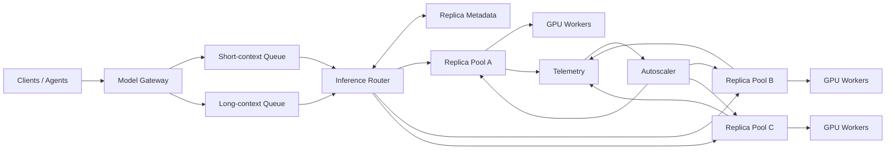

# System Design #2 — Multi-tenant LLM Inference Platform

> **Design a platform that serves multiple open-weight models to many internal
> agent and application workloads from a shared pool of GPUs.**

```text
thousands of concurrent requests     streaming responses
long context                         multiple model sizes
multi-tenant quotas                  low TTFT
high throughput                      GPU efficiency
autoscaling                          failure recovery
cost control                         OpenAI-compatible API
```

This is the Model Service box that [System Design #1](agent-execution-platform.md)
deliberately declared out of scope. The two compose:

```text
Agent Runtime
     │
     ▼
Model Gateway
     │
     ├── routing
     ├── quota
     ├── admission control
     └── backpressure
     │
     ▼
Inference Scheduler
     │
     ▼
GPU Replica Pool
     │
     ├── prefill
     ├── decode
     ├── batching
     └── KV cache
```

**Part 1** covers the workload model and why this is not a web serving problem.
Everything after — routing, autoscaling, fairness, cost — depends on getting
this part right, and most weak answers go wrong here rather than later.

---

## 1. Clarify

| question | what it changes |
|---|---|
| Open-weight self-hosted, or a vendor API behind a gateway? | if vendor, this is a proxy design and GPU scheduling disappears |
| How many models, and how large? | one model per replica, or multiple resident; LoRA versus full weights |
| Context length? | KV cache sizing, which sets replica capacity (§7) |
| Interactive or batch? | TTFT matters or it does not, and that changes the scheduler |
| Is the caller an agent? | agent traffic has a very specific shape (§8) |
| Strict tenant isolation, or fair sharing? | separate replicas versus shared batches |
| Latency SLO, and on which metric? | TTFT and TPOT are different problems |

**Scope to state:** self-hosted open-weight models, a handful of sizes,
interactive traffic dominated by long-context agent workloads, fair sharing with
per-tenant quotas rather than dedicated hardware.

---

## 2. What a request actually costs

The first thing to establish, because every later decision follows from it: an
LLM request is **not a unit of work**. Its cost has two components with
different shapes.

```text
cost(request) = prefill(prompt_tokens) + decode(output_tokens)
```

- `prompt_tokens` is known at admission.
- **`output_tokens` is not known until the request finishes.**

That second line is the one that breaks every scheduling intuition borrowed from
web serving. You cannot bin-pack, queue by expected cost, or set a meaningful
timeout for work whose size is only revealed by doing it.

Measured on one deployment — Qwen3.6-27B-FP8, single A100 80GB, vLLM 0.28:

```text
2,000 output tokens   →  41.0 s      ≈ 49 tokens/s single stream
  600 output tokens   →  12.7 s      ≈ 47 tokens/s
```

Decode rate is stable. **Total request time is therefore almost entirely a
function of how much the model decides to say**, which nothing upstream knows in
advance.

---

## 3. Prefill and decode are two different machines

The single most important fact in this design.

|  | **prefill** | **decode** |
|---|---|---|
| what it does | process the whole prompt at once | produce one token, then the next |
| parallelism | all prompt tokens in parallel | strictly sequential per sequence |
| FLOPs | O(prompt length) | O(1) per token |
| bound by | **compute** | **memory bandwidth** |
| happens | once | thousands of times |
| batching | already saturated | nearly free throughput |

**Why decode is bandwidth-bound.** To produce one token the GPU must read the
entire weight matrix from HBM. With ~31 GB of FP8 weights, one decode step moves
31 GB regardless of whether it is generating for one sequence or for sixty-four.
At batch 1 that bandwidth produces a single token; at batch 64 the same read
produces sixty-four.

> **Decode at batch size 1 wastes almost all of the GPU.** Batching is not a
> throughput optimisation in LLM serving — it is the difference between using
> the hardware and not.

**Why prefill is different.** Prefill is a dense matrix multiply over the whole
prompt and is already compute-saturated. Batching prefills does not multiply
throughput the way batching decode does; two large prefills mostly compete.

This asymmetry is why the two phases want opposite scheduling policies, and why
running them on the same device at the same time is the central tension of the
whole design.

### The measurement that makes it concrete

Same endpoint, a 53,348-token prompt, three consecutive identical requests:

```text
cold   53,348 prompt tokens  →  13.0 s
warm                          →   0.9 s
warm                          →   0.6 s
```

Roughly **20×**, and it is entirely prefill: the decode portion was identical in
all three. The second and third requests skipped the prompt because the KV cache
still held it — which is the whole argument for prefix caching (§8) and the
reason routing is a first-class concern rather than a load-balancer setting.

---

## 4. Why this is not a web serving problem

Five differences, each of which invalidates a standard technique.

**1. Request cost is unknown and unbounded.** Web requests are approximately
constant work. Here the distribution is wide and the tail is the point — a
request may emit 20 tokens or 8,000. Queueing disciplines that assume knowable
service time do not apply.

**2. A request occupies memory for its entire lifetime.** The KV cache for a
sequence is allocated at admission and grows with every token until the request
ends. The scheduling unit is *a slot held for tens of seconds*, closer to a VM
than to an HTTP request. A replica with 64 slots serving 60-second requests
admits roughly one request per second, whatever its FLOPs say.

**3. The bottleneck is memory, not CPU or FLOPs.** Capacity is set by how many
tokens of KV cache fit alongside the weights (§7). Adding compute does not add
capacity.

**4. Latency has two independent metrics.** They fail for different reasons and
one can be fine while the other is terrible:

```text
TTFT   time to first token    = queueing + prefill
TPOT   time per output token  = decode batch contention
```

A large prefill in the batch hurts *everyone's* TPOT. A deep queue hurts only
TTFT. Reporting "p99 latency" over whole requests hides both, because it is
dominated by output length, which is a property of the request rather than of
the service.

**5. Requests are preemptible mid-flight.** Unlike an HTTP handler, a sequence
can be evicted and resumed — recompute its KV cache, or swap it out. That makes
admission less dangerous than it looks and gives the scheduler a lever no web
tier has.

### Head-of-line blocking is physical here

The decode loop advances every sequence in the batch one token per step. If a
large prefill is scheduled into that loop, every other sequence stalls for its
duration.

```text
decode step, decode step, [ 30k-token prefill ], decode step, ...
                           ↑
                  every sequence in the batch waits
```

This is why **chunked prefill** exists: split a long prompt into pieces and
interleave them with decode steps, trading a little TTFT for the long request to
protect TPOT for everyone else. It is a scheduling decision inside the engine,
and being able to name it is a strong signal.

---

## 5. Continuous batching

Static batching — collect N requests, run them together, return together — is
wrong here for a specific reason: sequences finish at different times, so the
batch runs at the speed of its longest member while finished slots sit idle.

**Continuous batching** treats the batch as a set that changes every step: when a
sequence emits its end token its slot is freed immediately and a waiting request
takes it at the next step.

```text
step k    [ A B C D ]
step k+1  [ A B C D ]      B finishes
step k+2  [ A E C D ]      E admitted into B's slot
```

Two consequences worth stating:

- **Admission happens continuously**, not at request arrival. The queue is
  drained at every decode step, so queue depth translates directly into TTFT.
- **`max_num_seqs` is the batch width**, and it is a memory decision rather than
  a throughput one — each concurrent sequence needs its own KV cache.

---

## 6. The memory budget, which is the capacity model

Everything a replica can do is decided by one subtraction.

```text
HBM
  − model weights
  − activations and runtime overhead
  = KV cache pool
```

KV cache per token:

```text
2 (K and V) × layers × kv_heads × head_dim × bytes_per_element
```

Measured anchor from one deployment:

```text
Qwen3.6-27B-FP8 weights          ≈ 30.9 GB
A40 48 GB     → ~17 GB for KV cache and runtime
A100 80 GB    → ~49 GB
```

The consequence that decides hardware:

```text
max_model_len = 32,768    one full-length sequence fits easily on 48 GB
max_model_len = 131,072   one full-length sequence needs roughly 4×
```

vLLM refuses to start if the KV pool cannot hold a single sequence of
`max_model_len`, so **context length is a hardware decision, not a
configuration flag**. Raising it from 32k to 128k on the same card does not make
long requests slower; it makes the server not start.

> Capacity in this system is *tokens of KV cache*, not requests per second.
> Every other number is derived from it.

### The tension to name

```text
long max_model_len   → fewer concurrent sequences
large batch          → higher throughput, more KV pressure
both at once         → preemption, or admission rejection
```

Three knobs — `max_model_len`, `max_num_seqs`, `gpu_memory_utilization` — all
spending the same budget. One measured deployment moved `max_num_seqs` from 8 to
4 precisely to buy headroom when the context window was widened.

---

## 7. Architecture



Two boxes are easy to collapse into one and should not be.

**Model Gateway — tenant-facing.** Authentication, per-tenant quota and budget,
OpenAI-compatible translation, admission. It reasons about *who is asking* and
never about which GPU.

**Inference Router — capacity-facing.** Picks a replica using live replica state:
KV pressure, queue depth, and which prefixes are already cached. It reasons about
*where this should run* and never about billing.

Keeping them apart means quota logic does not need to know about KV cache, and
routing does not need to know about tenants — except where fairness deliberately
crosses the line (§11).

---

## 8. Two queues, because prefill blocks

Chunked prefill (§4) protects the *batch* from a long prompt. It does nothing for
the *queue*: a 500-token request that arrives behind a 60,000-token request still
waits for it to be admitted.

```text
                 ┌── short-context queue ──┐
gateway ────────▶│                         ├──▶ router
                 └── long-context queue ───┘
```

Served with a weight, so short requests get predictable TTFT and long ones get a
floor that prevents starvation.

**The split point is computed, not chosen.** From the measured prefill rate:

```text
53,348 prompt tokens in 13.0 s   →  ≈ 4,100 tokens/s of prefill
```

If the TTFT target is 2 s, then

```text
2 s × 4,100 tokens/s  ≈  8,000 tokens
```

is the largest prompt that can meet it from cold. Above it the request cannot hit
the short-context SLO however it is scheduled, so it belongs in a queue with a
different promise rather than in the same queue degrading everyone else's.

**Label the number honestly.** 8K is an SLO-derived threshold *for this measured
model, this hardware and this configuration*. Change the model, the card, the
prefix hit rate or whether chunked prefill is on, and it moves. The sentence that
travels is not the number:

> I wouldn't hard-code 8K globally. I derive the request-class boundary from
> measured cold-prefill throughput and the TTFT SLO.

Saying "we separate long and short requests" is fine. Deriving the boundary is
the difference.

---

## 9. Routing

**Round-robin is the expensive default.** It distributes load evenly and throws
away the 20× from §3 on every request.

Route by **prefix affinity**: prefer the replica whose KV cache already holds
this prompt's prefix.

```text
hash the prompt prefix
      ↓
candidate replicas holding it
      ↓
among candidates, pick the least loaded
      ↓
no candidate, or all above a load ceiling → least loaded overall
```

Two refinements that matter:

**Affinity is a preference with a ceiling, not a rule.** Pure affinity
concentrates every request for a popular system prompt onto one replica. The
ceiling — a KV utilisation or queue-depth threshold above which affinity is
abandoned — is what keeps it from becoming a hotspot generator.

**For agents, session affinity is a cheap approximation.** An agent's successive
calls share a monotonically growing prefix, so routing by `job_id` gets most of
the benefit of prefix hashing with none of the machinery. Prefix hashing still
earns its place for the *shared* prefix across jobs — a common system prompt,
few-shot examples, a shared repository context.

### What "loaded" means here

Not requests per second. The router reads replica metadata for:

```text
KV cache utilisation      the real capacity signal
queue depth               the TTFT signal
running sequences         against max_num_seqs
```

A replica at 95% KV with four running sequences is *full*; a replica at 30% KV
with forty short sequences has room. Request count says the opposite of the
truth in both cases.

---

## 10. Prefix caching: when the 20× applies

```text
applies                              does not apply
shared system prompts                unique one-shot prompts
agent transcripts (grows each step)  high-cardinality user text
few-shot blocks                      after eviction
shared RAG context                   after a prefix-altering edit
```

**The agent case is the best case that exists.** Each step re-sends the whole
transcript, so step *n*'s prompt is step *n−1*'s prompt plus a delta. The cache
hit is nearly total and only the delta is new work. From the sizing in
[design #1 §17](agent-execution-platform.md):

```text
naive prefill        220 req/s × 30K tokens  ≈ 6.6M tokens/s   not buildable
with prefix caching  220 req/s ×  2K tokens  ≈ 440K tokens/s
```

**~15× on cluster size.** Prefix caching is not an optimisation in an agent
workload; it is the difference between a buildable design and an unbuildable one.

### The tension nobody mentions

**Cached prefixes and running sequences share the same KV pool.** Every block
held for a possible future hit is a block unavailable to a sequence generating
right now.

```text
more cached prefixes  →  higher hit rate, fewer concurrent sequences
fewer cached prefixes →  more concurrency, more re-prefill
```

So eviction policy is a capacity decision. LRU is the default and is wrong for
this workload in one specific way: an agent that pauses for 45 s between steps
looks cold, and evicting its prefix costs a full re-prefill of tens of thousands
of tokens on its next call. **Weight by re-prefill cost, not by recency** — a
large prefix that would be expensive to rebuild is worth keeping longer than a
small one touched more recently.

---

## 11. Replica sizing

Three configurations, and the choice follows from §6 rather than from taste.

| | when | cost |
|---|---|---|
| one model per GPU | weights + a useful KV pool fit on one card | simplest; the default |
| tensor parallel across N | weights alone do not fit, **or** `max_model_len` needs more KV than one card leaves | an all-reduce per layer on every step — real latency, worst for decode |
| several models per GPU | all small, and traffic is bursty and uncorrelated | weights crowd out KV; rarely worth it |

Worked from the measured anchor:

```text
27B FP8 weights ≈ 31 GB

one A100 80 GB     →  ≈ 49 GB KV
TP2 over 2× 80 GB  →  15.5 GB weights each, ≈ 64 GB KV each, ≈ 129 GB total
```

TP roughly **doubles** usable KV per replica while adding per-layer
communication. The decision rule:

> Use tensor parallelism when **context length** demands KV that one card cannot
> provide — not to make decode faster. Decode is bandwidth-bound and TP adds
> synchronisation to it.

---

## 12. Autoscaling

**Scale on the wrong signal and nothing works.**

| signal | why it fails |
|---|---|
| requests/s | requests are not equal (§2) |
| GPU utilisation | decode keeps utilisation high while producing almost nothing at batch 1 |
| CPU | irrelevant |

Scale on what actually saturates:

```text
queue wait time        → the TTFT SLO is being missed
KV cache utilisation   → capacity is genuinely gone
```

### Cold start is the constraint

A replica must download and load tens of gigabytes of weights and allocate its
KV pool. That is **minutes**, against a traffic spike measured in seconds.

Reactive autoscaling therefore cannot work by itself. What does:

- **Warm pool** of loaded-but-idle replicas, sized to the expected spike rather
  than to average load.
- **Predictive scaling** on schedule, since internal agent traffic is usually
  diurnal and known.
- **Headroom as policy** — run at 70% rather than 95%, and treat the difference
  as the price of a workload that cannot scale in under a minute.

### Scale-down is the harder direction

A replica holds sixty in-flight sequences, each possibly minutes from finishing.
Draining means: stop admitting, wait, and then decide what to do about the
stragglers.

```text
stop admitting
      ↓
wait for natural completion, with a drain deadline
      ↓
at the deadline: fail the remainder, or re-prefill them elsewhere
```

There is no migration of a partially generated sequence between replicas that
does not cost a full re-prefill, so **the drain deadline is a real cost
decision** rather than a formality.

---

## 13. Multi-tenancy and fairness

Fairness requires a unit, and **requests are the wrong unit** — a request may be
500 tokens or 500,000.

Tokens are closer, but prefill and decode tokens do not cost the same. Use a
measured cost model:

```text
cost  =  a · prompt_tokens  +  b · output_tokens
```

with `a` and `b` derived from the measured prefill and decode rates on the
actual hardware — from §3 and §8 on this deployment, roughly 4,100 prefill
tokens/s against 49 decode tokens/s per stream, so a decode token is far more
expensive in occupancy terms than a prefill token.

### Three enforcement points, each doing a different job

```text
gateway    admission, quota, budget       who is allowed to ask
router     replica choice                 whether a tenant can be isolated
engine     batch slots                    who gets the next step
```

### The noisy neighbour is concrete here

A tenant sending 100,000-token prompts degrades **everyone's TPOT** on that
replica, because the prefill enters the same decode loop (§4). Mitigations, in
increasing order of cost:

1. the long-context queue (§8) — keeps it out of the short path,
2. per-tenant concurrency caps — bounds how much of a replica one tenant holds,
3. dedicated replicas — real isolation, real cost, and the honest answer for a
   tenant that needs a latency guarantee.

---

## 14. Failure

**A replica dies holding sixty sequences.** There is no checkpoint for a
half-generated response — the KV cache is the state, and it is gone.

| request type | response |
|---|---|
| short, idempotent | retry on another replica; the cost is a re-prefill |
| long-running generation | fail it and surface the reason; a silent retry doubles the bill |
| streaming, partially delivered | the client already has a prefix of the answer |

That last row is the interesting one. A streaming client holds real output, so
"retry" could mean re-prompting with what was already emitted and continuing.
That is **not the same request** — it changes the conditioning — and if it is
done at all it must be visible to the caller rather than hidden inside a retry
loop.

Which connects directly to [design #1](agent-execution-platform.md): a retried
model call is a **new sample**, not a repeat. The agent's trajectory branches,
and the platform that retried silently is the reason nobody can reproduce the
run.

---

## 15. Cost

The bill is in GPU-hours. The user sees tokens. The exchange rate between them
**is** the design.

```text
cost per token  =  GPU $/hour  ÷  tokens/hour
```

and `tokens/hour` is almost entirely a function of batch size, because decode
reads the same weights per step regardless (§3).

```text
A100 at ~$2/hour

batch 1     ≈ 49 tokens/s  ≈ 176K tokens/hour   ≈ $11 per million tokens
batch 32    ≈ 20× that                          ≈ $0.6 per million tokens
```

> **Batch size is not a performance knob. It is the price.**

Which reframes every earlier section: routing that preserves prefix cache,
queue separation that keeps batches full, autoscaling that avoids running at
batch 2 — these are cost decisions expressed as latency mechanisms.

---

## 16. Agent traffic has a specific shape

Worth its own section because it is the dominant workload here and it is
unusually well-behaved in one way and badly behaved in another.

```text
prompt        large and growing monotonically — 20K to 60K tokens by late in a run
output        modest — hundreds to a few thousand tokens
cadence       one call per agent per ~45 s
aggregate     smooth, because thousands of agents desynchronise
```

**The good part:** prefix growth is append-only, so cache hit rates approach
total and only the delta is prefilled (§10).

**The bad part:** every active sequence carries an enormous KV footprint, so the
pool is consumed by context rather than by concurrency.

**The saving grace, and the arithmetic to have ready:**

```text
one call per agent per 45 s, each occupying a slot for ~10 s
duty cycle ≈ 10/45 ≈ 22%

10,000 agents  →  ≈ 2,200 concurrent sequences, not 10,000
```

Between steps an agent holds **no active-sequence KV** — it is running a test in
a container somewhere else, occupying no decode slot. That is why one inference
pool serves far more agents than it has slots, and it is the quantitative
version of the "do not pin a GPU to each agent" rule from
[design #1 §8](agent-execution-platform.md).

**But do not conflate two capacity dimensions.** Its *prefix cache blocks* may
well still be resident, and that is the point of keeping them:

```text
agent leaves to run pytest
      ↓
active decode slot released
      ↓
its historical prefix may stay in cache
      ↓
next step returns and skips tens of seconds of prefill
```

So a 22% duty cycle estimates **active serving demand**. It does not estimate
**total KV residency**, which is set by the cache retention policy of §10.
Sizing a pool from the duty cycle alone under-counts memory by whatever the
cache is holding — which, for this workload, is deliberately a lot.

---

## 17. Where Part 3 would pick up

With the workload model established, the remaining questions are all downstream
of it:

```text
routing              prefix affinity, and why round-robin is expensive
prefix caching       when the 20× applies and when it does not
replica sizing       one model per GPU, tensor parallel, or multiple models
autoscaling          scaling on what signal, given cold start is minutes
multi-tenancy        fairness over what unit, when requests are not equal
failure handling     a replica dies holding 60 sequences of state
cost                 tokens, GPU-hours, and which one the bill is in
agent traffic        the specific shape it has, and why it is the good case
```

Remaining, and none of it is load-bearing for the interview:

```text
speculative decoding     throughput at the cost of complexity
disaggregated serving    separate prefill and decode fleets — the logical
                         conclusion of §3, and increasingly the real answer
quantisation choices     FP8 versus INT4, quality against memory
LoRA multiplexing        many fine-tunes on shared base weights
```

**Disaggregation is the one to know exists.** If prefill is compute-bound and
decode is bandwidth-bound, running them on the same device forces one
compromise for both. Splitting them into separate pools, with KV transferred
between, lets each be sized and scaled for its own bottleneck — at the cost of
moving tens of gigabytes per request across the fabric. Naming it as the logical
endpoint of §3 is a good closing move.

---

## 18. Worked routing decision

> Two A100 replicas of the same model.
>
> ```text
> Replica A                         Replica B
>   50K-token prefix cached           idle
>   12 active decode sequences        no prefix cached
>   queue delay 1.8 s                 queue delay 0
>   KV occupancy 78%                  KV occupancy 20%
> ```
>
> New request: 52K prompt whose first 50K matches A's cached prefix,
> `max_output_tokens` 2K, normal priority.
>
> **Which replica — and design the score so the answer flips by itself when A is
> overloaded enough?**

### The memory question, asked correctly

The trap is to price the request at its context length:

```text
52K tokens × ~200 KB/token ≈ 10.5 GB      ← wrong on A
```

**A already holds those 50K tokens of KV.** They are counted in its 78%. Under
paged attention with prefix caching the new sequence takes a reference to the
existing blocks and allocates only what is genuinely new:

```text
incremental KV(A)  =  2K new prompt + up to 2K decode  ≈ 4K tokens
incremental KV(B)  =  52K prompt + up to 2K decode     ≈ 54K tokens
```

A factor of thirteen, in the opposite direction from the naive reading. So a
cache hit changes **two** terms, not one:

```text
cache hit  →  lower T_prefill
           →  lower ΔKV_required
```

which is why it should never be modelled as a `cache_hit = true` bonus. It is
two physical quantities getting smaller.

**One second-order effect worth knowing.** Those 50K cached blocks were
*evictable* while nothing referenced them; admitting this request pins them.
A's usable headroom therefore falls by more than 4K tokens' worth — the
reclaimable cache it was implicitly counting on is now held. The drop is far
smaller than 52K and larger than 4K, and a free-pool accounting that ignores
refcount transitions will over-admit.

### Two stages, and the first is not a score

**Hard admission:**

```text
IncrementalKV(request, r)  ≤  FreeKV(r) − SafetyMargin
```

Incremental, not total context. A replica that fails this is removed from
consideration rather than penalised inside the score — a near-OOM replica should
not be rescued by a large enough cache bonus.

**Then soft scoring:**

```text
Score(r) = w_q·T̂_queue + w_p·T̂_prefill + w_d·T̂_decode + w_m·M(KV_post)

KV_post = KV_current + IncrementalKV
```

Prefix hits show up automatically in `T̂_prefill` and in `KV_post`. There is no
branch for them anywhere.

### Estimating the terms

**Prefill.** A prefills the 2K delta ≈ 0.5 s; measured warm full hits landed at
0.6–0.9 s. B prefills 52K cold ≈ 12.7 s, consistent with the measured 53K/13.0 s.

**Decode, stated carefully.** The batch-1 rate is not the answer:

```text
2000 / 49 ≈ 41 s        ← single-stream, idle replica
```

At small batch sizes decode benefits strongly from batching, because the weight
read is amortised across sequences. As batch size and context length grow,
activation, attention and KV-cache traffic matter more, and per-sequence
inter-token latency eventually degrades. **Where that crossover sits depends on
the architecture, GQA or MQA, batch, context length, kernel, GPU and KV dtype** —
so it is a direction, not a formula.

```text
A, 13 sequences at long context  →  perhaps ~35 tok/s per sequence
```

**Illustrative estimate, not measured.** `13 × 50K` decode was never benchmarked
on this deployment, and presenting a guess as a derived number is the fastest way
to lose an interviewer who has.

### There is no universally optimal answer

```text
TTFT            A: 1.8 + 0.9  ≈  2.7 s     B: 0 + 12.7  ≈  12.7 s
completion      A: 2.7 + ~57  ≈  60 s      B: 12.7 + 41 ≈  54 s
```

**A can win TTFT while B wins end-to-end completion.** Which one the router
should optimise depends on the request class:

| workload | objective |
|---|---|
| interactive chat | `TTFT + α · ITL` — the first token is the product |
| agent call | end-to-end latency — the caller waits for the whole response |
| batch / offline | GPU cost per completed token — latency barely matters |

> There is no universally optimal router. Policy is a function of **request
> class, SLO, and current replica state** — and a design that names one metric
> as "the" objective has not asked what the traffic is for.

### The fleet argument, and its limit

B spends 12.7 s of compute-bound GPU time recomputing 50K tokens A already
holds. At scale, redundant prefill is among the largest sources of wasted
capacity.

But "A is obviously better for the cluster" overstates it:

> **A has a strong cluster-efficiency advantage because it avoids recomputing a
> 50K-token prefill, but that benefit must be compared against the marginal
> latency and memory pressure imposed on the sequences already resident on A.**

Which introduces the quantity that actually matters:

```text
MarginalCost(request → replica)
```

not *how long does this request take*, but **how much total cost does placing it
here add across everything already running there**. So the mature objective is

```text
Score(r) = request latency  +  β · cluster externality
```

with the externality covering:

```text
added inter-token latency for resident sequences
KV pressure
eviction risk
preemption risk
prefix-cache eviction — displacing a hot prefix costs the next job a full prefill
```

### What makes it flip automatically

`M(KV_post)` must be **non-linear**: a modest penalty at 78%, rising steeply near
90–95% until it dominates any prefill advantage. Then

```text
A: queue 15 s, KV 94%
```

spills to B through the same formula, with no special case and no `if cached`
branch.

> **Cache affinity is not a routing rule. It is one term — now two — in an
> estimated-work model.**

### The two-minute version

> I'd route to A, but not because it has the cache — because of what the cache
> does to two terms. It removes 50K tokens of prefill, about 12 seconds, and it
> means the request needs roughly 4K tokens of incremental KV instead of 54K,
> since those blocks are already resident and get referenced rather than
> reallocated.
>
> I'd make that a two-stage decision. First a hard admission check on
> *incremental* KV against free pool minus a safety margin, so a replica near
> OOM is eliminated rather than outscored. Then a score over estimated queue,
> prefill and decode time plus a non-linear penalty on post-admission KV
> occupancy.
>
> A wins here, though not unambiguously — it wins time-to-first-token while the
> idle replica might win end-to-end, and which of those matters depends on
> whether this is a chat turn or an agent call. What breaks the tie is the fleet:
> avoiding a redundant 50K prefill is worth more than a few seconds of this
> request's latency, as long as it does not degrade the twelve sequences already
> on A too far — which is what the memory term and the externality term are for.
>
> And because affinity is a term rather than a rule, when A reaches 94% occupancy
> and a 15-second queue the same formula sends the request to B. No branch for
> cache hits anywhere.
